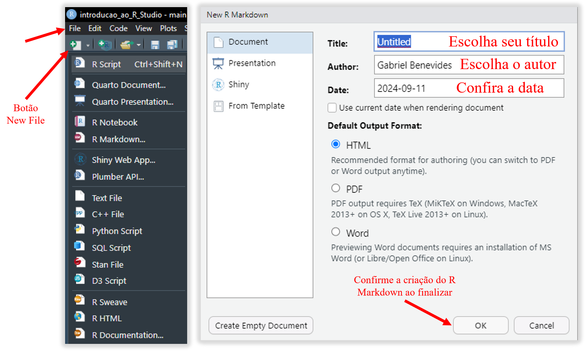
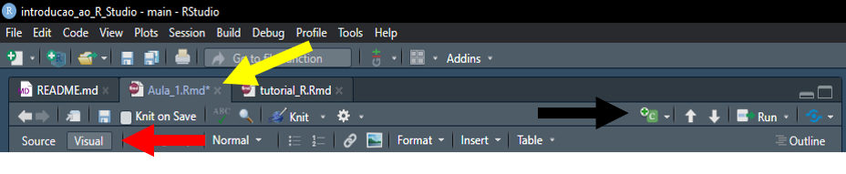
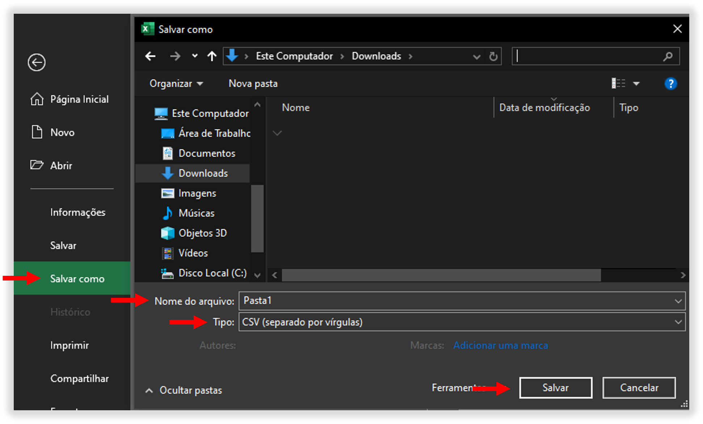

# Cabeçalho

```{r setup, include=FALSE}
knitr::opts_chunk$set(echo = TRUE)
```

## R Markdown

This is an R Markdown document. Markdown is a simple formatting syntax for authoring HTML, PDF, and MS Word documents. For more details on using R Markdown see <http://rmarkdown.rstudio.com>.

When you click the **Knit** button a document will be generated that includes both content as well as the output of any embedded R code chunks within the document. You can embed an R code chunk like this:

```{r cars}
summary(cars)
```

## Including Plots

You can also embed plots, for example:

```{r pressure, echo=FALSE}
plot(pressure)
```

Note that the `echo = FALSE` parameter was added to the code chunk to prevent printing of the R code that generated the plot.

## Introducao as livrarias

Livrarias (library) são ferramentas que serão utilizadas dentro do R Studio para facilitar suas análises de dados. Pense nas livrarias como extensões do R, que vão deixar sua linha de código menor e mais funcional.

Ao invés de ter que escrever linhas e linhas de código, algumas livrarias vão utilizar menos informações para realizar a mesma função.

Para utilizar as livrarias você precisa instalar elas no seu R Studio, nem todas estão já nativas. As livrarias são compostas de pacotes (packages), portanto, iremos instalar pacotes (install.packages). Usaremos a função `install.packages("nome_do_pacote")`.

### Criando um Markdown para trabalhar

Para programar, é importante que você tenha sua aba `.rmd`, que nada mais é que o R Markdown.

Crie um Markdown pelo seguinte caminho: `File > New File > R Markdown...`

Uma tecla rápida (New File) também se encontra na porção superior da sua barra de ferramentas, onde você também pode selecionar a criação de um `R Markdown`.



A partir de agora você terá uma aba com o nome definido por você para trabalhar. É muito parecida com um bloco de notas, e a digitação é livre.

### Como executar uma linha de código?

Sempre que você digita um código, ele pode ser executado de forma individual, ou você pode executar uma série de códigos em conjunto. Além disso, você pode criar um *bloco de código* (*code chunk*), nada mais é que uma aba para incluir códigos dentro dela e que te permite organizá-los melhor.

1.  Para executar uma única linha de código, com o mouse, clique na linha de interesse e pressione `Ctrl + Enter`, o R irá executar apenas a linha selecionada.

2.  Para executar várias linhas, utilize `Ctrl + Shift + Enter`, selecionando todas as linhas ou selecionando a linha final.

3.  Se seu código estiver em um chunk, você também pode clicar no botão "play".

### Criando um Bloco (Chunk)

Um bloco de código é um pequeno quadrado onde você pode escrever seu comando, sem se misturar com textos e exemplos, que é o que estamos digitando até agora. Tudo isso que está escrito não é considerado linha de código, se fosse, teríamos muitos problemas para o aplicativo diferenciar o que é realmente relevante, não é mesmo?

Por isso, criamos o bloco para que possamos explicar e separar tudo aquilo que fazemos, marcando bem as etapas, e facilitando caso precisemos fazer alguma correção futura. Se fizermos uma linha de código muito grande e algo falhar, vamos precisar revisar muitas etapas de uma vez só... e isso pode ser muito cansativo! Separando por blocos, podemos executar por partes, e caso aconteça um erro em um bloco, saberemos que o problema está ali, e não no código completo.



Repare que na seta amarela, podemos ver as abas, e a aba `.rmd` que quero utilizar está marcada.

Recomendo que marque a opção Visual, apontada na seta vermelha, para uma melhor visualização do seu trabalho, **ISSO NÃO É OBRIGATÓRIO**. A apresentação Source / Visual vai muito de cada pessoa, e você pode preferir um ou outro.

Na seta preta, temos o símbolo do C+ onde podemos adicionar alguns blocos, e ali selecionaremos a opção `R`.

Uma caixa com {r} será criada, e dentro dela você pode digitar o que desejar.

## Instalando pacotes

```{r}
# Em caso de erro, baixe as bibliotecas novamente para atualizações.

# Baixar pacotes do CRAN para a biblioteca
install.packages("tidyverse")
install.packages("tibble")
install.packages("skimr")
install.packages("janitor")
install.packages("esquisse")
install.packages("ggthemes")
install.packages("plotly")
install.packages("gghighlight")
install.packages("patchwork")
install.packages("ggsci")
install.packages("gapminder")
install.packages("scales")
install.packages("ggpmisc")
install.packages("RColorBrewer")
install.packages("sidrar")
install.packages("showtext")
install.packages("car")
install.packages("dplyr")
```

Os pacotes de livrarias só precisam ser baixados **UMA ÚNICA VEZ** para que sejam instalados no seu R. Depois disso, você só irá precisar fazer um novo download para atualizações ou caso tenha tido falhas na primeira instalação, não tendo concluído adequadamente.

### Chamando livrarias

Agora que tem seus pacotes instalados, você pode chamar essas livrarias para trabalharem na sua área de programação. Ou seja, você pode ativar a livraria para utilizar as ferramentas dela, dentro da sua linha de código. Usaremos a função `library(nome_do_pacote)`.

```{r}
# Não se esqueça de SEMPRE ativar as bibliotecas quando abrir o aplicativo.

library(tidyverse) # Metapacote 
library(tibble) # Pacote
library(skimr) # Diagnóstico de tabela
library(janitor) # Limpeza de tabelas
library(esquisse) # Plotagem de gráficos prática
library(ggthemes) # Temas de ggplot
library(plotly) # Gráficos interativos
library(gghighlight) # Marcar pontos e linhas 
library(patchwork) # Unir gráficos
library(ggplot2) # GGPlot - vem dentro do pacote do Tidyverse
library(ggsci) # Paleta de cores 
library(gapminder) # Dataset sobre população, PIB e expectativa de vida dos países
library(scales)
library(ggpmisc) 
library(RColorBrewer) # Paletas de cores
library(sidrar) # Ferramenta de upload de dados governamentais
library(showtext) # Editor para personalização de texto
library(car) 
library(dplyr)
```

**ATENÇÃO**: As livrarias precisam ser chamadas **SEMPRE** que você abrir o R Studio. Ou seja, uma vez que executar o comando library e estiver usando o aplicativo, não será necessário que re-faça este comando. Mas, se fechar o aplicativo e abri-lo novamente, as livrarias que for utilizar precisam ser chamadas mais uma vez.

Você não precisa chamar todas as livrarias, escolha qual vai usar, e ative apenas ela. Aqui estão apenas exemplos que podem ser funcionais, por isso todos já foram instalados.

## Diretório de trabalho

O diretório de trabalho é o local onde o R Studio vai buscar os arquivos que você quer, e também o local onde ele vai salvar os arquivos que você criar, como plots (gráficos) e imagens. Quando seu R Studio é aberto pela primeira vez, ele já define um local padrão em que ele irá buscar seus arquivos, **mas isso não significa que ele está procurando no local certo**.

Nós dizemos então que o R está "apontando" para algum local.

Para saber para onde está sendo apontado, use as funções `getwd()` para saber o local atual, e `setwd()` para escolher um novo local.

```{r}

# getwd() vai te mostrar onde o R está buscando seus arquivos atualmente.

getwd()
```

```{r}

# setwd() será para editar/alterar este local, para isso, você precisa colocar dentro do parênteses () o endereço da pasta que quer definir como seu novo diretório.

setwd("C:\Users\User\Desktop") # Neste caso, estou pedindo para que o meu diretório seja na área de trabalho.

# Você pode digitar esse caminho manualmente ou utilizar um prompt e/ou o explorar do Windows para descobrir qual endereço correto.
```

### Importação de arquivos

O pacote `'READR'` é importante nesta etapa, para ler os arquivos que quiser importar para seu trabalho. READR pode ler arquivos como '*csv*', '*tsv*', '*fwf*' e '*rds*' de uma forma rápida e eficaz.

Utilize `read.csv()` para importar diretamente arquivos *csv* para o R. O mesmo se aplica para os outros tipos de arquivo.

```{r}
# Exemplo de importação, de um arquivo chamado banco_teste, já na pasta do projeto.

dados <- read.csv ("banco_teste.csv", sep = ';', dec = ',')

# o sep= é usado para dizer ao R que as colunas deste arquivo serão separadas por ; (ponto e vírgula), enquanto o dec= está dizendo que as casas decimais estão sendo separadas por , (vírgula).
```

**ATENÇÃO**: Não recomendamos o uso de banco de dados em excel (`.xlsx`), mas sim em `.csv` (separado por vírgulas). Caso sua tabela esteja em Excel, faça o seguinte processo na tabela excel:

1.  Vá na opção **Arquivo**;

2.  Selecione **Salvar Como**;

3.  Selecione o local onde quer salvar o arquivo;

4.  Escolha o **Nome**, e no **Tipo** coloque *CSV (separado por vírgulas)*;

5.  Clique em **Salvar**.



Além disso, perceba que no código acima, para importação do `.csv` foi utilizado apenas o nome do arquivo: `dados <- read.csv ("banco_teste.csv", sep = ';', dec = ',')`. Isso pode ser feito pois antes o diretório de trabalho já havia sido definido, portanto, o R está procurando este arquivo dentro da **pasta correta**.

Se você não definir seu diretório de trabalho, precisaria colocar o código da seguinte forma: `dados <- read.csv ("C:\Users\User\Desktop\banco_teste.csv", sep = ';', dec = ',')`

Lembre-se, o caminho é só um exemplo, tudo vai depender de onde realmente seu arquivo está!

# Hora de praticar!

Se tudo correu bem até aqui, parabéns! Você já obteve muita informação, mas isso tudo fica muito confuso porquê tem muito texto, não é mesmo?

Vamos então reduzir e resumir tudo, em uma linha de código única e contínua, e vamos praticar.

```{r}

# Chamando livraria (já temos os pacotes instalados).

library(readr)
library(car)
library(dplyr)

# Atualizando o diretório para o local que eu quero.

setwd("C:\Users\User\Desktop")

# Importanto banco de dados .csv

dados <- read.csv("banco_teste.csv", sep = ';', dec = ',')

# NÃO SE ESQUEÇA DE ATUALIZAR OS DADOS ACIMA PARA O CAMINHO DO SEU COMPUTADOR, AGORA É A HORA QUE REALMENTE TEM QUE FUNCIONAR PARA VOCÊ!
```

Se tudo der certo, na aba **ENVIRONMENT**, você verá que apareceu um novo *dado* (*data*). Isso ocorre porquê você atribuiu ao código, **um objeto**, que é o `dados` que vem antes da seta (`<-`).

Sempre que colocar um **NOME** seguido de seta (`<-`) ou igual (`=`) e um código, o R vai entender que aquele código tem aquele nome. Posteriormente, você não vai mais precisar executar o código, vai poder usar o objeto pelo nome que você escolheu, que neste caso é **`dados`**.

Poderia ser então:

`dados <- read.csv("banco_teste.csv", sep = ';', dec = ',')`

`dados = read.csv("banco_teste.csv", sep = ';', dec = ',')`

## Visualizar sua base de dados

```{r}

# Parabéns! Use o comando abaixo para ver sua base de dados.

view(dados) # Você irá abrir uma nova aba com sua base de dados, completa.
```

```{r}

# Outra opção de comando para visualizar seus dados.

glimpse(dados) # Você irá ver no console algumas informações dos seus dados.
```

Parabéns! Se tudo correu bem até aqui, você está pronto para as próximas etapas.
