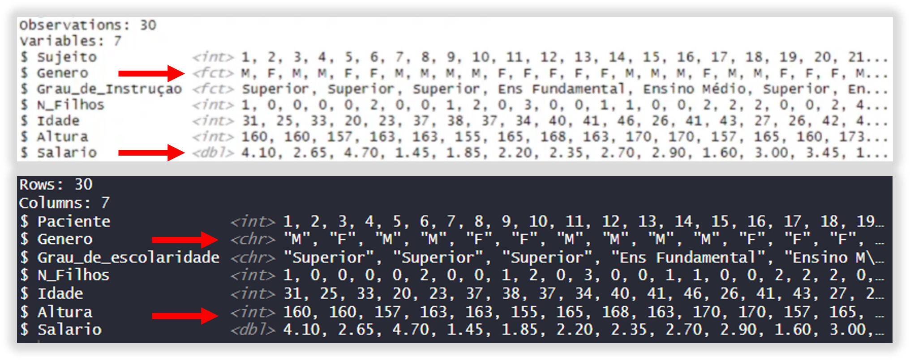

# Cabeçalho

```{r setup, include=FALSE}
knitr::opts_chunk$set(echo = TRUE)
```

### R Markdown

This is an R Markdown document. Markdown is a simple formatting syntax for authoring HTML, PDF, and MS Word documents. For more details on using R Markdown see <http://rmarkdown.rstudio.com>.

When you click the **Knit** button a document will be generated that includes both content as well as the output of any embedded R code chunks within the document. You can embed an R code chunk like this:

```{r cars}
summary(cars)
```

### Including Plots

You can also embed plots, for example:

```{r pressure, echo=FALSE}
plot(pressure)
```

Note that the `echo = FALSE` parameter was added to the code chunk to prevent printing of the R code that generated the plot.

## Conceitos básicos

Agora que temos a base de compreensão, precisamos entender alguns conceitos internos, ou seja, que são utilizados dentro do R.

Falaremos sobre:

1.  Objetos;

2.  Função;

3.  Comentários;

4.  Variáveis.

O **OBJETO** é o que o próprio nome sugere. Pense na vida real, e você está fazendo uma conta de matemática na folha de papel.. vamos supor que você fez `4 + 5 + 8 / 2 * 7` e deixou anotado neste papel. Se você for pedir alguém para pegar o papel para você, vai pedir que a pessoa pegue a **conta**. Ou seja, você deu um nome curto, para toda sua fórmula matemática.

A **FUNÇÃO** nada mais é que o seu código, a sua ação. Ou seja, é a regra que você vai colocar na sua linha de código para o R tomar alguma ação.

Os **COMENTÁRIOS** são textos que você pode incluir durante sua linha de código, sem que o R execute eles, e que vão te ajudar a entender o que está fazendo, você já viu vários deles aqui. Os comentários podem ser inseridos usando um sustenido (`hashtag / #`) antes do texto, dessa forma, o R vai entender que tudo após a `#` não é função, e não compõe seu código.

### Função, código e comentário

```{r}

# Aqui está um comentário! Repare que uso vários durante os códigos.

conta = 4 + 5 + 8 / 2 * 7

# o CONTA é o seu objeto, e o objeto representa o RESULTADO de toda sua regra matemática, que será 37. Sempre que você quiser este resultado, basta agora executar o CONTA.

conta # este resultado, inclusive, já aparece no seu environment (ambiente).
```

### Tipos de Variáveis

As **VARIÁVEIS** possuem algumas classificações, onde podemos ter **variáveis numéricas**, **variáveis categóricas** e **texto**. Sendo:

**INT**: Inteiros. São dados avaliados pelo R como números inteiros, sem casa decimal.\
**Exemplo**: `1, 2, 3, 4, 5, 6, 40, 200, 1500, 7000, etc.`, *é uma variável numérica*.

**DLB**: Double. São dados avaliados pelo R como números com 2 casas decimais.\
**Exemplo**: `4.10, 8.10, 6.99, 1.45, 12.15, 110.10, etc.`, *é uma variável numérica*.

**FCT**: Fatores (variáveis categóricas). Um exemplo é a *Variável Categórica Nominal Dicotômica*, onde se tem apenas 2 (duas) categorias.\
**Exemplo**: Masculino e Feminino.

**ORD**: Variável ordinal (variáveis categóricas). Um exemplo é a *Variável Categória Ordinal*, onde se tem várias categorias e existe ordem entre elas.\
**Exemplo**: Ensino Fundamental, Ensino Médio, Ensino Superior.

**CHR**: Caracteres (texto). São textos, dados que são representados entre aspas.\
**Exemplo**: `"Gabriel"`, `"Joao"`, `"Ventilador"`, `"Mesa"`.



Compreender as variáveis é importante, pois em alguns casos será necessário o manuseio (codificação) destas variáveis. [Codificando variáveis] nada mais é que dizer ao R que, por exemplo, o que ele identificou como *número inteiro* (**INT**) na verdade é uma *variável categórica* (**FCT**).

## Tabelas e vetor

Tabelas são bases de dados muito usadas em R, e podemos testar com arquivos `.csv` já existentes, mas podemos criar as nossas para exercitar o manuseio, controlando o tamanho, os dados e para que não fique muito pesado.

Para essa etapa, podemos usar a função `data.frame()` para criar um data frame, ou `tribble()` para criar um tible. Vamos usar também a função `c()` para criar uma vetor, que é um conjunto de dados.

### Data Frame

```{r}

# data.frame() cria o data frame, mas você precisa também especificar as colunas, e quais valores vão dentro destas colunas.

data = data.frame(
    nome = c("Gabriela", "Julia", "Beatriz", "Gabriel", "Carla", "Renata", "Miguel", "Marcos"),
    altura = c(1.59, 1.60, 1.78, 1.84, 1.53, 1.70, 1.68, 1.80),
    idade = c(30, 25, 31, 28, 32, 18, 41, 23),
    genero = c("F", "F", "F", "M", "F", "F", "M", "M"))

# data é o nome que dei para o OBJETO (toda a tabela).
# data.frame() é a função.
# nome = é a primeira coluna que escolhi, e dentro de c() defini quais nomes vão nesta coluna.
# o mesmo se aplica para altura, idade e genero.

data # para visualizar seu data.frame
```

### Tibble

```{r}

# tribble() cria uma tible, mas você também precisa especificar as colunas e quais dados vão estar em cada coluna, neste caso, sendo um indivíduo por linha.

data_tibble = tribble(
  ~nome, ~altura, ~idade, ~genero,
  "Gabriela", 1.59,   30, "F",
  "Marcos", 1.52, 21, "M",
  "Júlia",   1.60,   25, "F",
  "Beatriz", 1.65,  31, "F",
  "Luiza",   1.73,   32, "F", 
  "Gabriel", 1.84, 28, "M"
  )

# data_tibble é o nome dado ao OBJETO (toda a tabela).
# tribble() cria a tabela.
# ~nome, ~altura, ~idade define as colunas, e vão nas mesma linha.
# você deve descrever nas próximas linhas, as informações na ordem que deseja que sejam incluídas em cada coluna.

data_tibble # para visualizar sua tible.
```

### Estatísticas gerais

Você pode muito rapidamente já obter valores estatísticos de suas bases de dados, com comandos simples.

Usaremos a função `summary()` para obter: **mínimo**, **1º quartil**, **mediana**, **média**, **3º quartil** e **máximo**. Dados estatísticos que podem ser úteis, e com uma única função.

Além disso, podemos utilizar a `library()` **Skimr**, usando a função `skim()`.

Para a obtenção de desvio padrão, podemos utilizar a função `sd()`. Neste caso, é preciso especificar em qual dado o `sd` será aplicado, portanto, você precisa definir sua coluna.\
Para isso, você precisa aprender uma nova função, que é referenciar a coluna de um data.frame.

Isso pode ser feito colocando o **nome do objeto**, seguido de **\$** e o **nome da coluna**.\
**Exemplo**: Data.frame se chama *DADOS*, e quero aplicar *SD* na coluna *IDADE*, logo = `sd(dados$idade)` é a forma de realizar essa função.

```{r}

summary(data) # ou summary(data_tibble), como preferir.


library(skimr) # ative a livraria da ferramenta antes de utilizá-la
skim(data) # ou skim(data_tibble), se preferir.


sd(data$idade) # o sinal de $ após data, é para escolher qual coluna a regra de desvio padrão deve ser aplicada. Lembre-se que SD não se aplica a caracteres.
```

## Pivotando base de dados

Tabelas podem ser **LARGAS**, ao molde que conhecemos do excel... com várias colunas na horizontal, mas também podem ser **LONGAS**... onde os valores estarão uns sobre os outros, em uma única coluna.

`pivot_longer()` transforma uma tabela em **TABELA LONGA**.\
`pivot_wider()` transforma uma tabela em **TABELA LARGA**.

Vamos ver isso na prática mais adiante, não se preocupe. Antes disso, precisamos aprender a codificar algumas variáveis.

## Codificando variáveis

Para realizar a codificação, precisaremos da livraria **DPLYR**, `library(dplyr)`, precisamos lembrar como se referencia uma coluna (`OBJETO$NOME_DA_COLUNA`), usar vetor `c()`, saber de que forma a variável está apresentada na base de dados e em que quero transformá-la.

Aqui, usaremos o `banco_codi`, onde temos as seguintes alterações:

-   Genero está representado como **0 e 1**, onde **0 = Masculino** e **1 = Feminino**.

-   Grau_de_escolaridade está representado como **0, 1 e 2**, onde **0 = Fundamental**, **1 = Medio** e **2 = Superior**.

Iremos trocar os números, por seus textos correspondentes, para uma planilha mais organizada.

```{r}

# ativando as livrarias.

library(dplyr)
library(readr)
library(tibble)

dados <- read.csv("banco_codi.csv", sep = ';', dec = '.') # pegando o arquivo .csv do diretório já previamente definido na aula_1.

glimpse(dados) # se reparar bem, genero e grau estao como INT.

dados$Genero <- factor(dados$Genero,
                       labels = c("M", "F"),
                       levels = c(0, 1))
# a funcao FACTOR incluiu M e F, respectivamente, no lugar de 0 e 1 na coluna GENERO.

dados$Grau_de_escolaridade <- factor(dados$Grau_de_escolaridade,
                                     labels = c("Fundamental", "Medio", "Superior"),
                                     levels = 0:2, ordered = TRUE)
# a funcao FACTOR incluiu os graus de escolaridade.

glimpse(dados) # repare que agora genero é classificado em FCT e grau, ORD.
```

Campos codificados, parabéns! Agora, repare que alguns campos da sua base de dados constam como ***NA***. O R identifica os valores ausentes e os classifica dessa forma, são os NA - missing values.

Não recomendo que mantenha estes valores como NA, em alguns casos isto pode prejudicar a sua análise, ou avaliações estatísticas / plotagem de gráficos.

## Codificando dados ausentes - NA (missing values)

Basicamente, iremos atribuir um valor para campos NA, e este valor precisa ser ABERRANTE e COMPLETAMENTE diferente dos valores que está buscando e/ou que são descritos na sua tabela. E porquê isso? Para que, posteriormente, você possa identificar estes valores e ignorá-los, sabendo que estes eram campos anteriormente vazios.

Você pode descobrir se existem valores ausentes na sua base usando `is.na()`. Esta função irá te mostrar em **TODA A BASE**, quais campos tem ***NA*** (representado por `TRUE`). Esta opção pode não ser recomendada para bases com muitas linhas, teria que ver linha por linha.

Outra opção é o `anyNA()`, que vai mostrar `TRUE` como resultado final, caso existam ***NA*** na sua base. Mas não vai especificar as posições.

```{r}

is.na(dados) # os campos TRUE significam que são campos NA.

anyNA(dados, recursive = FALSE) # o resultado [1] TRUE significa que existem campos NA na sua base.

# vamos pedir ao R que inclua o valor -999 no lugar dos NA.

dados[is.na(dados)] <- 999

view(dados)
```

ATENÇÃO: Os campos de variáveis numéricas que estavam como ***NA*** foram substituídos por **999**. Entretanto, as variáveis fatoriais (`FCT`) e ordinais (`ORD`) mantiveram o ***NA***.\
Isso acontece porque esta função não funciona para este tipo de variável.

## Hora de praticar!

Ao invés de utilizarmos uma planilha previamente pronta, que tal criarmos a nossa própria?

Vamos criar um `data.frame()` que contenha as seguintes colunas:

1.  Paciente (apenas números);

2.  Idade;

3.  Genero (inclua 0 para M, e 1 para F - **para que possa praticar codificação**)

4.  Altura (em *cm*)

5.  Peso (em *kg*)

Faça pelo menos 10 pacientes, para praticar mesmo as etapas de criação de coluna e vetor. Lembre-se que compreender estas etapas será fundamental para passos futuros.

### Criando data.frame

```{r}

teste <- data.frame(
            paciente = c(1, 2, 3, 4, 5, 6, 7, 8, 9, 10),
            idade = c(14, 16, 23, 10, 87, 38, 20, 51, 44, 28),
            genero = c(0, 1, 1, 1, 0, 1, 0, 0, 1, 0),
            altura = c(140, 138, 153, 101, 160, 192, 167, 151, 144, 184),
            peso = c(45, 80, 65, 25, 55, 102, 70, 81, 61, 74)
)
```

### Variáveis e estatística

```{r}

glimpse(teste) # o GENERO precisa ser codificado, posteriormente

sd(teste$idade) # desvio padrão na idade
sd(teste$peso) # desvio padrão no peso

summary(teste) # minima, media, mediana, maxima e 1º/3º quartil de todas as colunas.
```

### Codificando

```{r}

teste$genero <- factor(teste$genero,
                       labels = c("M", "F"),
                       levels = 0:1)

glimpse(teste)
```

Finalizado! Você pode brincar mais com seus dados, deixando espaços em branco (***NA***), ou pivotando a tabela. Segue um exemplo de pivotagem:

```{r}

# transformando a tabela larga (wide) em longa (long).

teste_longo <- pivot_longer(teste,
                            cols = c(idade, peso, altura),
                            values_to = "dados",
                            names_to = "variaveis")

view(teste_longo) #veja como a tabela se apresenta de forma diferente.
```
